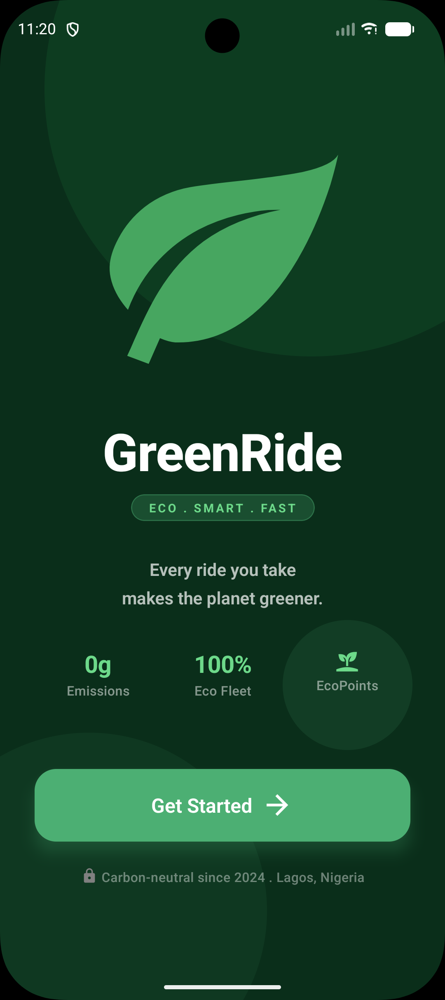

# GreenRide 🌿

GreenRide is a modern, eco-friendly ride-hailing prototype built with **React Native** and **Expo**. It emphasizes sustainable transportation by offering Electric and Hybrid vehicle options with a clean, nature-inspired user interface.

## 🚀 Features

- **Eco-Conscious Fleet:** Filter and choose between Electric and Hybrid rides.
- **Real-time Map Integration:** Interactive map using `react-native-maps` with custom styling for both light and dark modes.
- **Smart Search:** Destination searching powered by Google Places API.
- **Dynamic Theming:** Seamless transition between Light and Dark modes with smooth animations.
- **Smooth Navigation:** Fluid screen transitions using React Navigation (Stack & Tabs).
- **Interactive UI:** Micro-interactions, haptic-like feedback, and responsive components.

## 📱 App Preview

|        Splash Screen         |           Home Screen (Light)           |                Home Screen (Dark)                 |
| :--------------------------: | :-------------------------------------: | :-----------------------------------------------: |
|  | .png>) | .png>) |

### Key Screens:

1. **Splash Screen:** A welcoming entry point with brand identity.
2. **Home Screen:** The main dashboard featuring a map view, destination search, ride filters, and available eco-rides.
3. **Confirmation Screen:** A modal view to review and confirm your ride details.
4. **Profile Screen:** Manage account settings and toggle app preferences.

## 🛠️ Tech Stack

- **Framework:** React Native (Expo)
- **Language:** TypeScript
- **Navigation:** React Navigation
- **Maps:** React Native Maps
- **Icons:** Expo Vector Icons (MaterialCommunityIcons)
- **Animations:** React Native Animated API

## ⚙️ Setup & Installation

Follow these steps to get the project running locally:

### 1. Prerequisites

- [Node.js](https://nodejs.org/) (v18 or higher recommended)
- [Expo Go](https://expo.dev/go) app on your mobile device OR an iOS Simulator/Android Emulator.

### 2. Clone the Repository

```bash
git clone https://github.com/your-username/greenride.git
cd greenride
```

### 3. Install Dependencies

```bash
npm install
```

### 4. Environment Variables

Create a `.env` file in the root directory and add your Google Maps API Key:

```bash
cp .env.example .env
```

Open `.env` and fill in:

```
EXPO_PUBLIC_GOOGLE_MAPS_API_KEY=your_google_maps_api_key_here
```

_Note: This key is required for the Google Places Autocomplete and Map functionality._

### 5. Start the Application

```bash
npm start
```

- Press **i** for iOS Simulator.
- Press **a** for Android Emulator.
- Scan the QR code with your Expo Go app to run on a physical device.

### 6. Run Unit Tests

```bash
npm test
```

This project uses **Jest** and **React Native Testing Library** for unit and integration testing.

## 💡 Assumptions

- **Location:** The app is currently mocked to focus on Lagos, Nigeria (`USER_LOCATION` in `MapViewComponent.tsx`).
- **Data:** Ride and driver data are currently provided via local mock files (`src/data/rides.ts`) for demonstration purposes.
- **API Key:** A valid Google Maps API key with "Maps SDK for Android/iOS" and "Places API" enabled is necessary for the full experience.

## 📄 License

This project is licensed under the MIT License - see the [LICENSE](LICENSE) file for details.

---

Built with ❤️ for a greener planet.
